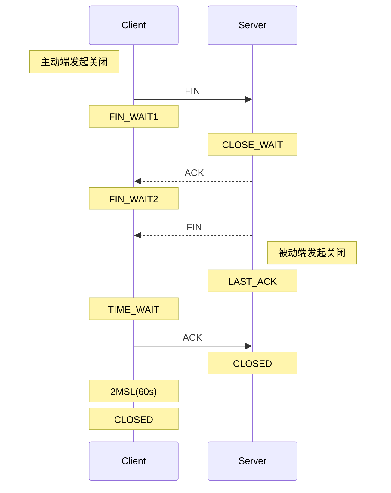
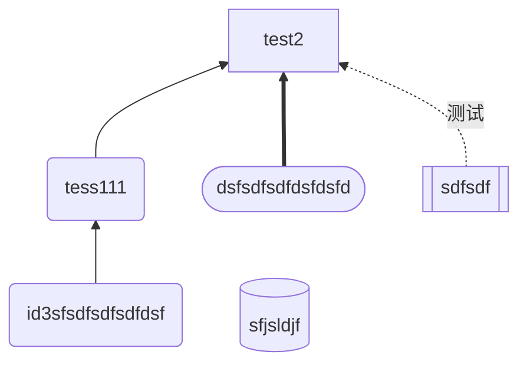
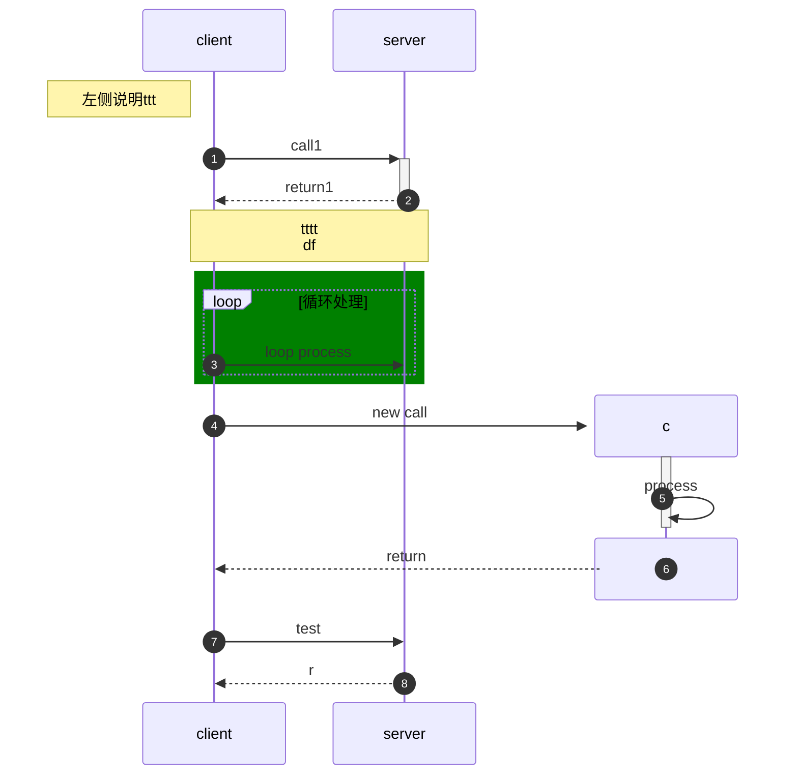
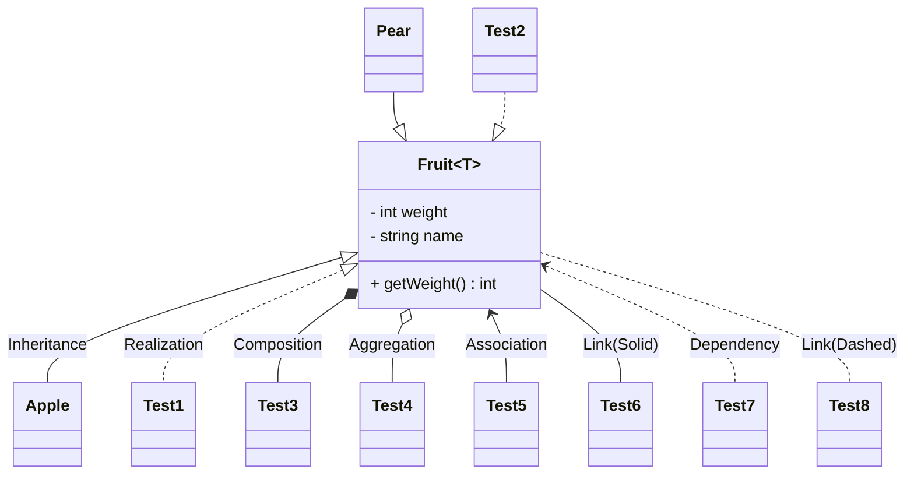
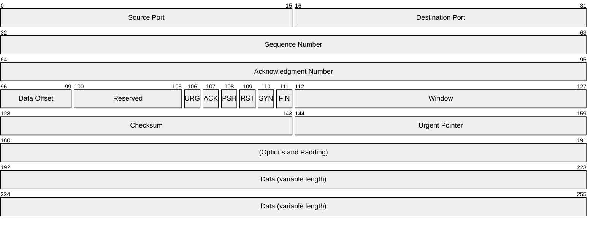
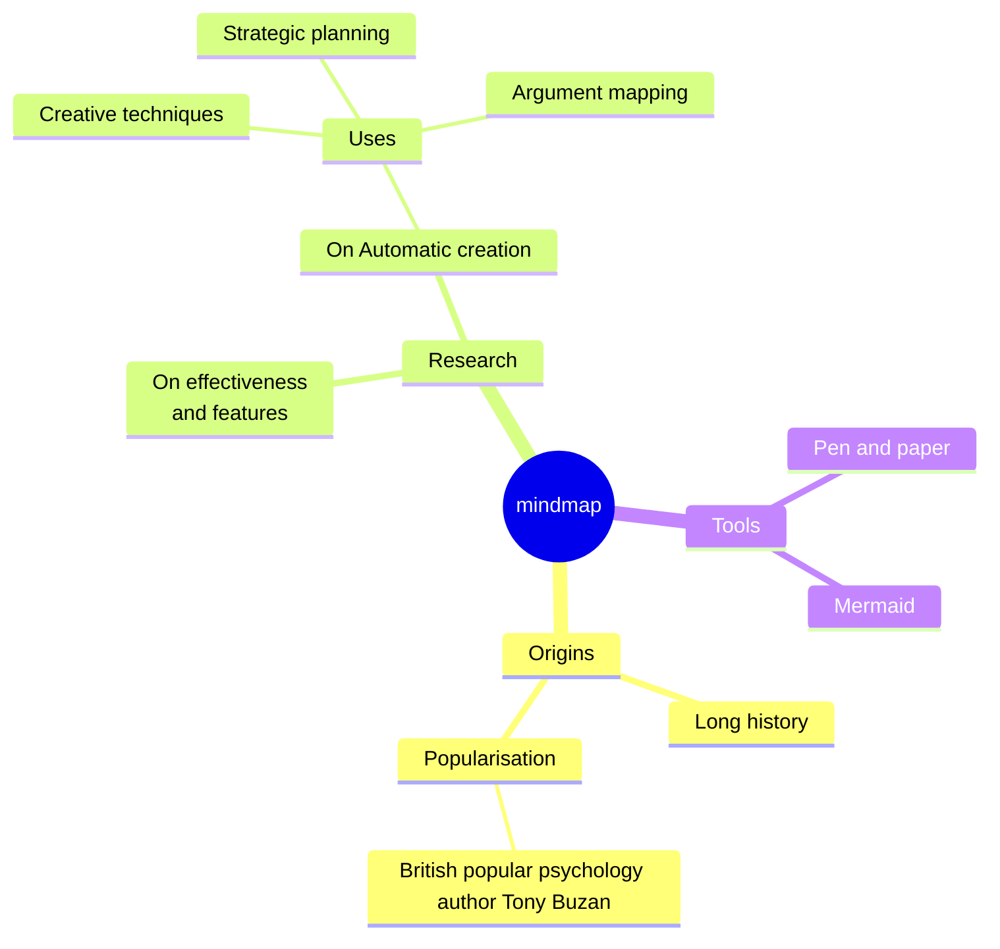
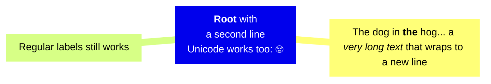
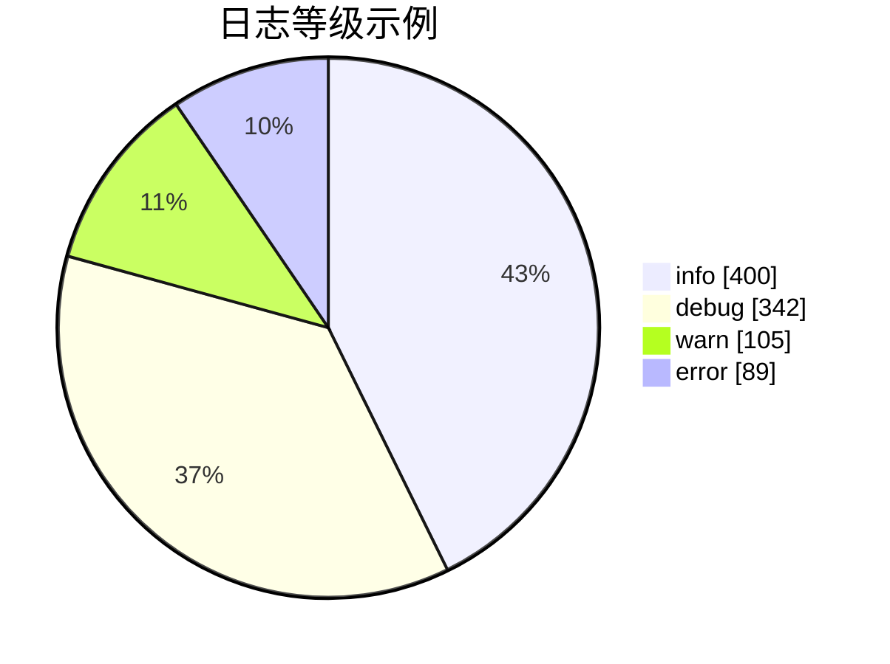
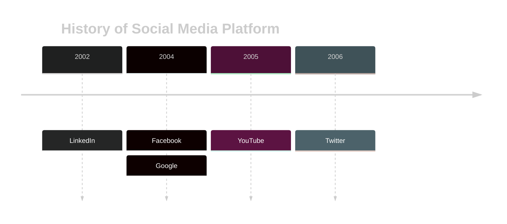
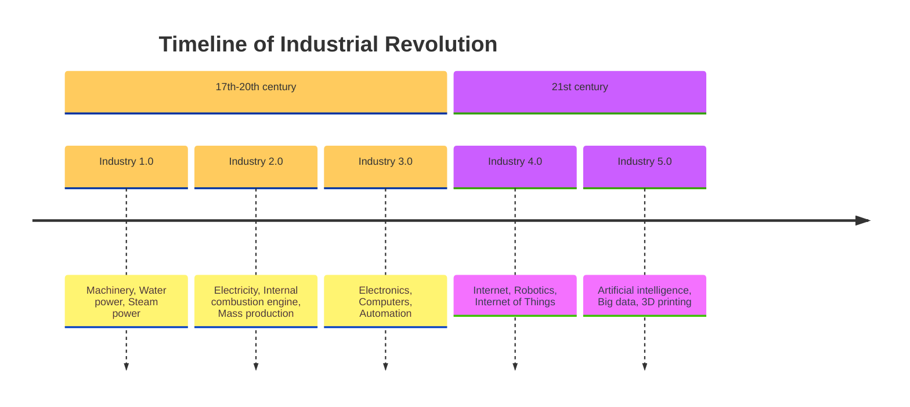

## 1. 简要介绍

本博客主题（`Chirpy`）中默认支持`Mermaid`语法，另外看最近看`LLM`问答的结果里有的也带了`Mermaid`图，画了一些图试了下看表现力还不错，后续可以用起来。

本篇对常用语法做下简要的操作熟悉，具体内容还是见下述的参考链接。

* 参考网站：[Mermaid语法](https://mermaid.nodejs.cn/syntax/flowchart.html)。

---

作为效果对比，之前在[TCP半连接全连接（三） -- eBPF跟踪全连接队列溢出（上）](https://xiaodongq.github.io/2024/06/23/bcctools-trace-tcp_connect)中用`PlantUML`生成的TCP连接关闭流程图如下，不大能接受：

{: width="340" height="600" }

用`Mermaid`语法生成的图效果如下：



## 2. 流程图

流程图关键字：`flowchart` 或 `graph`

**示例1：**

```
---
title: node
---
%% flowchart LR
graph LR
id1[this  is id xxx] e1@ --> tess
e1@{animate: true}
id1 --> id3 -->|指向| id4 -.-> id1
id2 --> test2
```

**效果：**

**<mark>注意：</mark>**chirpy博客主题里，需要在`Mermaid`内容开头加上下面语句块，才会渲染为`Mermaid`图形：

```yaml
---
mermaid: true
---
```

```mermaid
---
mermaid: true
---
---
title: node
---
%% 使用flowchar和graph关键字都行
%% flowchart LR
graph LR
id1[this  is id xxx] e1@ --> tess
e1@{animate: true}
id1 --> id3 -->|指向| id4 -.-> id1
id2 --> test2
```

**示例2：**

```
%%flowchart TD
flowchart BT
id3(id3sfsdfsdfsdfdsf) --> tess(tess111)
tess --> test2
id4([dsfsdfsdfdsfdsfd]) ==> test2
id5[[sdfsdf]] -. 测试 .-> test2
id6[(sfjsldjf)]
```

**效果：**



## 3. 时序图

注意是在消息之前create和<mark>destroy</mark>参与者

**示例1：**

```
%% 时序图
sequenceDiagram
    autonumber
    participant a as client
    participant b as server
    note left of a: 左侧说明ttt
    a ->> +b: call1
    b -->> -a: return1

    note over a,b: tttt<br/>df

    %%注释
rect green
    loop 循环处理
        a ->> b: loop process
    end
end

    create participant c
    a ->> +c: new call
    c ->> -c:process
    destroy c
    c -->> a: return

    a ->> b: test
    b -->> a: r
```

**效果：**



## 4. 类图

**示例：**

```
classDiagram
%% +表示public，-表示private，#:protect，~:封装/内部
class Fruit~T~ {
    - int weight
    - string name
    + getWeight() int
}

%% 继承（子类继承父类），--|> 或者 <|--，指向的是父类。可以:加标签
Fruit <|-- Apple : Inheritance
Pear --|> Fruit
%% 实现（抽象类），..|> 或者 <|..，指向的是抽象类
Fruit <|.. Test1 : Realization
Test2 ..|> Fruit

%% 组合
Fruit *-- Test3 : Composition
%% 聚合
Fruit o-- Test4 : Aggregation
%% 关联
Fruit <-- Test5 : Association
%% 链接（实心）
Fruit -- Test6 : Link(Solid)
%% 依赖
Fruit <.. Test7 : Dependency
%% 链接（虚线）
Fruit .. Test8 : Link(Dashed)
```

**效果：**



## 5. 网络包图

直接试下 [数据包图](https://mermaid.nodejs.cn/syntax/packet.html) 里的示例。

**示例：TCP协议**

```
---
title: "TCP Packet"
---
packet-beta
0-15: "Source Port"
16-31: "Destination Port"
32-63: "Sequence Number"
64-95: "Acknowledgment Number"
96-99: "Data Offset"
100-105: "Reserved"
106: "URG"
107: "ACK"
108: "PSH"
109: "RST"
110: "SYN"
111: "FIN"
112-127: "Window"
128-143: "Checksum"
144-159: "Urgent Pointer"
160-191: "(Options and Padding)"
192-255: "Data (variable length)"
```

**效果：**



## 6. 脑图/思维导图

[思维导图](https://mermaid.nodejs.cn/syntax/mindmap.html)中的示例。

**示例1：**

```
%% 脑图
mindmap
  root((mindmap))
    Origins
      Long history
      ::icon(fa fa-book)
      Popularisation
        British popular psychology author Tony Buzan
    Research
      On effectiveness<br/>and features
      On Automatic creation
        Uses
            Creative techniques
            Strategic planning
            Argument mapping
    Tools
      Pen and paper
      Mermaid
```

**效果：**



**示例2：**

```
mindmap
    id1["`**Root** with
a second line
Unicode works too: 🤓`"]
      id2["`The dog in **the** hog... a *very long text* that wraps to a new line`"]
      id3[Regular labels still works]
```

**效果：**



## 7. 饼图

**示例：**

```
%% 饼图关键字pie，显示具体数值则可加 showData
pie showData
    title 日志等级示例 
    "info": 400
    "debug": 342
    "warn": 105
    "error": 89
```

**效果：**



## 8. 时间线图

**主题可选：**`base`、`forest`、`dark`、`default`、`neutral`

**示例1：**

```
%%{init: { 'logLevel': 'debug', 'theme': 'dark' } }%%
%% 时间线图
timeline
    title History of Social Media Platform
    2002 : LinkedIn
    2004 : Facebook 
        : Google
    2005 : YouTube
    2006 : Twitter
```

**效果：**



**示例2：**

```
%%{init: { 'logLevel': 'debug', 'theme': 'base' } }%%
timeline
    title Timeline of Industrial Revolution
    section 17th-20th century
        Industry 1.0 : Machinery, Water power, Steam <br>power
        Industry 2.0 : Electricity, Internal combustion engine, Mass production
        Industry 3.0 : Electronics, Computers, Automation
    section 21st century
        Industry 4.0 : Internet, Robotics, Internet of Things
        Industry 5.0 : Artificial intelligence, Big data, 3D printing
```

**效果：**


